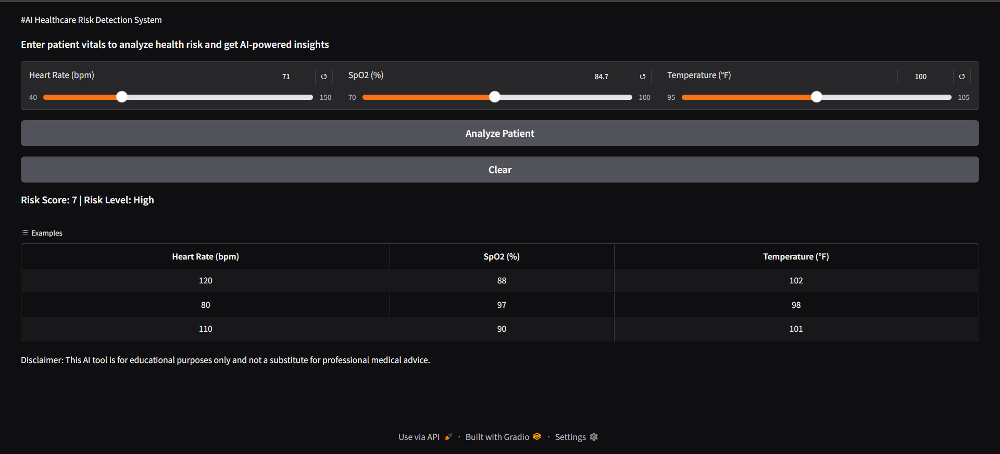
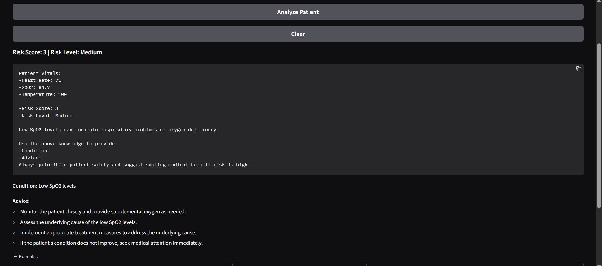

# 🩺 AI-Powered Healthcare Risk Detection System

---

## 📌 Overview

This project is an AI-powered healthcare system that analyzes patient vitals such as **Heart Rate, SpO2, and Temperature** to detect potential health risks and generate intelligent medical insights.

It combines rule-based risk scoring with a Large Language Model to provide meaningful and structured health analysis.

---

## ❗ Problem Statement

Early detection of health risks based on vital signs is crucial, but continuous monitoring and expert analysis are not always accessible. Many patients fail to recognize warning signs in time.

This project aims to provide an AI-driven solution that quickly evaluates patient vitals and assists in early risk identification.

---

## 💡 Inspiration

This project is inspired by real-world scenarios where patients experiencing symptoms like **low oxygen levels, high fever, or abnormal heart rate** require immediate attention, but timely medical consultation may not always be available.

The system is designed to act as a preliminary assistant for risk awareness.

---

## 🚀 Features

* 📊 Risk Score Calculation (Low / Medium / High)
* 🤖 AI-powered medical insights using Gemma
* 🖥️ Interactive UI using Gradio
* ⚡ Fast and simple health risk analysis
* 🔐 Secure token handling using environment variables
* 🚀 Deployment-ready with Hugging Face Spaces

---

## 🛠️ Tech Stack

* Python
* PyTorch
* Transformers (Hugging Face)
* Gradio

---

## 🧠 How it Works

1. User inputs patient vitals (Heart Rate, SpO2, Temperature)
2. System calculates a risk score using predefined conditions
3. Risk level is classified as Low, Medium, or High
4. Input is passed to an LLM for deeper analysis
5. AI generates condition insights and medical advice

---

## 🔍 Example

**Input:**

* Heart Rate: 120 bpm
* SpO2: 88%
* Temperature: 102°F

**Output:**

* Risk Score: High
* Condition: Possible infection or respiratory issue
* Advice: Seek immediate medical attention

---

## 📷 Screenshots

### 🖥️ User Interface

### 📊 Output Result

---

## 📁 Project Structure

AI-HealthCare-Risk-Detection/
├── app.py
├── AI_Healthcare_Risk_Detection.ipynb
├── requirements.txt
├── README.md
├── ui.png
└── output.png
---

## 🔮 Future Improvements

* Integration with real-time health monitoring devices
* Enhanced accuracy using medical datasets
* Mobile application version
* Multi-patient dashboard system
* Emergency alert integration

---

## ⚠️ Disclaimer

This project is developed for educational and hackathon purposes only.
It is **not a substitute for professional medical advice, diagnosis, or treatment**.

---

## 🙌 Acknowledgment

Built as part of a hackathon project using modern AI tools and frameworks.

---
